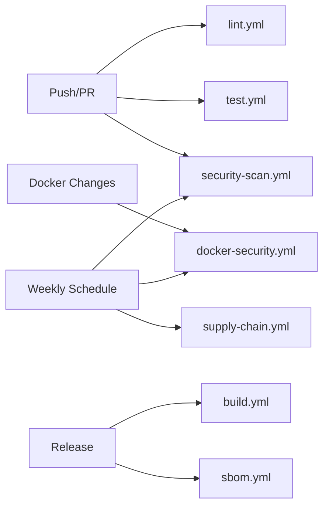

# GitHub Actions CI/CD Workflows

This directory contains comprehensive CI/CD workflows for ServerInspector, covering testing, security, and release automation.

## Workflow Overview

### Core Workflows

#### 🧪 `test.yml` - Automated Testing
**Triggers:** Push to any branch, Pull requests to main
- **Unit Tests**: Runs pytest across Python 3.10-3.13 on Ubuntu, Windows, macOS
- **Integration Tests**: Tests against real services (nginx, etc.) on Ubuntu
- **Coverage**: Generates coverage reports and uploads to Codecov
- **Matrix Strategy**: Tests all combinations of OS and Python versions

#### 🔍 `lint.yml` - Code Quality
**Triggers:** Push to any branch, Pull requests to main
- **Ruff**: Fast Python linter (PEP 8, security issues, best practices)
- **Black**: Code formatting validation
- **isort**: Import sorting validation
- **Flake8**: Additional linting with complexity checks
- **Pylint**: Static code analysis for unused imports/variables

#### 🎨 `format.yml` - Auto-formatting
**Triggers:** Manual dispatch only
- **Black**: Automatically formats all Python code
- **isort**: Automatically sorts imports
- **Auto-commit**: Commits formatting changes back to branch
- **Note**: Use sparingly, typically on feature branches before PR

### Security Workflows (SAST/DAST)

#### 🔒 `security-scan.yml` - Application Security
**Triggers:** Push/PR to main, Weekly schedule (Sundays)
- **Jobs:**
  1. **security-scan**: Python-specific security analysis
     - `pip-audit`: Scans dependencies for known CVEs
     - `safety`: Checks for vulnerable package versions
     - `bandit`: Static analysis for Python security issues (SQL injection, XSS, etc.)
  2. **codeql-analysis**: GitHub's semantic code analysis
     - Deep analysis of code patterns
     - Finds complex vulnerabilities (injection, authentication flaws)
  3. **dependency-review**: PR-only dependency vulnerability check
  4. **secret-scanning**: Scans for leaked credentials using TruffleHog

#### 🐳 `docker-security.yml` - Container Security
**Triggers:** Changes to Docker files, Weekly (Mondays), Manual
- **Trivy**: Multi-layer container vulnerability scanner
  - Scans OS packages, app dependencies
  - Results uploaded to GitHub Security tab
- **Docker Scout**: CVE scanning with remediation advice
- **Hadolint**: Dockerfile best practices linter
- **Syft**: Generates SBOM for Docker images

#### 📦 `sbom.yml` - Software Bill of Materials
**Triggers:** Push/PR to main, Releases, Manual
- **CycloneDX**: Industry-standard SBOM format (JSON/XML)
- **License Report**: Lists all dependency licenses
- **Release Attachment**: Automatically attaches SBOM to releases
- **Compliance**: Supports supply chain transparency requirements

#### 🔗 `supply-chain.yml` - Supply Chain Security
**Triggers:** Push/PR to main, Weekly (Tuesdays), Manual
- **OpenSSF Scorecard**: Measures project security best practices
  - Checks for branch protection, dependency updates, code review
  - Score visible in GitHub Security insights
- **License Compliance**: Validates no GPL/AGPL (MIT incompatible)
- **Build Provenance**: SLSA-compliant build attestation

### Build & Release

#### 🏗️ `build.yml` - Build Executables
**Triggers:** Push to main/master, Version tags (v*), Manual
- **PyInstaller**: Creates standalone executables
- **Multi-platform**: Builds for Linux, Windows, macOS
- **Artifacts**: Uploads both `serverinspect` and `si` binaries
- **Release Integration**: Attaches executables to GitHub releases

## Security Dashboard

After workflows run, security findings appear in:
1. **Security > Code scanning alerts** - CodeQL, Trivy, Hadolint findings
2. **Security > Dependabot** - Dependency updates and vulnerability alerts
3. **Insights > Community > OpenSSF Scorecard** - Overall security score
4. **Actions > Workflow runs > Artifacts** - Detailed JSON reports

## Workflow Dependencies



## Badge Examples

Add to README.md:

```markdown


```

## Required Secrets

### Optional (for enhanced features):
- `CODECOV_TOKEN` - For Codecov integration (can work without for public repos)

### Not Required:
- Most workflows use GitHub-provided tokens automatically
- Docker scanning works without Docker Hub credentials
- CodeQL requires no additional setup

## Maintenance

### Weekly Tasks
- Review security scan results in GitHub Security tab
- Check OpenSSF Scorecard recommendations
- Update dependencies flagged by Dependabot

### Before Release
1. Ensure all workflows pass on main branch
2. Review SBOM and license compliance
3. Verify security scans are clean
4. Tag release with `v*` format (triggers build workflow)

## Customization

### Adjusting Security Thresholds

Edit `security-scan.yml`:
```yaml
# Change severity levels
severity: 'CRITICAL,HIGH,MEDIUM'  # Remove MEDIUM for fewer alerts
```

Edit `supply-chain.yml`:
```yaml
# Allow GPL licenses if needed
if pip-licenses | grep -iE "AGPL|SSPL"; then  # Remove GPL from filter
```

### Changing Schedule

```yaml
schedule:
  - cron: '0 0 * * 0'  # Sundays at midnight UTC
  # Format: minute hour day_of_month month day_of_week
```

### Matrix Testing

Reduce test matrix for faster CI:
```yaml
# test.yml
matrix:
  os: [ubuntu-latest]  # Only test Linux
  python-version: ['3.11', '3.12']  # Reduce Python versions
```

## Troubleshooting

### Workflow Fails on `pip-audit`
**Cause**: Known vulnerability in dependency
**Fix**: Update vulnerable package or add to ignore list

### CodeQL Timeout
**Cause**: Large codebase analysis takes >6 hours
**Fix**: Reduce analysis scope or split into multiple jobs

### Docker Scan Fails
**Cause**: Base image has vulnerabilities
**Fix**: Update base image in Dockerfile or accept risk with justification

### License Check Fails
**Cause**: New dependency has GPL/AGPL license
**Fix**: Replace with MIT-compatible alternative or update workflow if intentional

## Best Practices

1. **Always run locally first**: Test with `pytest` and `ruff` before pushing
2. **Check Security tab**: Review findings before merging PRs
3. **Keep workflows updated**: Dependabot handles action version updates
4. **Don't disable security**: If workflow fails, fix issue rather than skip
5. **Monitor artifacts**: Review uploaded reports for detailed findings

## Additional Resources

- [GitHub Actions Documentation](https://docs.github.com/actions)
- [OpenSSF Best Practices](https://bestpractices.coreinfrastructure.org/)
- [SLSA Framework](https://slsa.dev/)
- [CycloneDX SBOM Standard](https://cyclonedx.org/)
